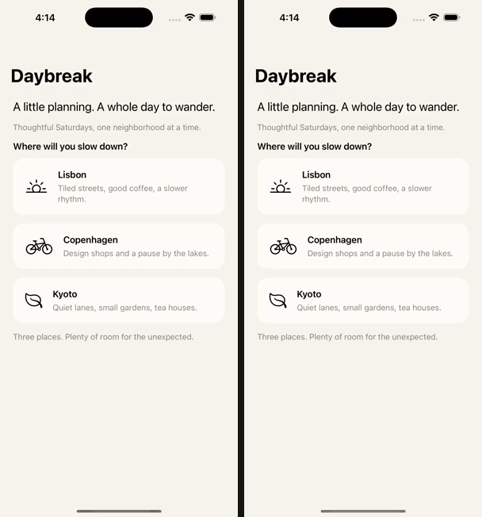

# Jev iOS Ultrafast

Give your coding agent a simulator verification tool, not another coding agent to manage.

Jev chooses the next action from an app's accessibility tree. A Python runner checks the choice, performs the action, and verifies the result from a fresh observation. Run one scenario, share a suite across multiple simulators, or run the same suite on every device in a pool.

[Agent skill](SKILL.md) · [Quick start](#quick-start) · [Parallel testing](docs/parallel-testing.md) · [Watch the demo](https://clueless-creations.github.io/jev-ios-ultrafast/media/comparison.html) · [Architecture](docs/architecture.md) · [MIT](LICENSE)

<a href="https://clueless-creations.github.io/jev-ios-ultrafast/media/comparison.html"></a>

## The loop

```text
Coding agent defines intent and expected evidence
                  |
          scenario or test suite
                  |
        Python device scheduler
         /         |         \
  Simulator A  Simulator B  SSH-connected Mac
       |           |             |
       +--- bounded Jev API calls +
                  |
       fresh observations and receipts
                  |
       one summary for the coding agent
```

Each device gets an exclusive lane. Each lane has its own model client; one coordinator limits API concurrency, request rate, and the total pricing reservation. The worker is Python code, not a separate Codex or Claude session.

The native path uses Apple's `xcrun simctl` and standalone [AXe](https://github.com/cameroncooke/AXe). **XcodeBuildMCP and MCP are not required.** Jev runs through [TypeSafe](https://docs.typesafe.ai/introduction) and Vercel AI Gateway. Screenshots are not sent to the model.

## Quick start

For local device execution, you need macOS, Xcode with an iOS Simulator runtime, Python 3.11+, and AXe. The included Daybreak build targets Apple Silicon. A coordinator using only SSH devices can run on Linux; each remote device host still needs a Mac, Xcode, AXe, and this same Jev revision.

Clone and install:

```sh
git clone https://github.com/Clueless-Creations/jev-ios-ultrafast.git
cd jev-ios-ultrafast
python3 -m venv .venv
. .venv/bin/activate
python -m pip install -e .
jev-ios doctor
jev-ios devices
```

AXe is discovered on PATH. Set `JEV_IOS_AXE` to use an explicit executable. Discovery of a binary bundled with another tool is only a convenience.

Set `AI_GATEWAY_API_KEY` or `VERCEL_OIDC_TOKEN` in the coordinator's environment. Alternatively, pass `--vercel-project YOUR_EXISTING_VERCEL_PROJECT` to an inference command using an existing Vercel CLI login. Credentials are not stored in scenarios, reports, or SSH device messages.

### Try the included app

Choose a simulator UUID from `jev-ios devices`:

```sh
export SIMULATOR_UDID="<simulator UUID>"
xcrun simctl bootstatus "$SIMULATOR_UDID" -b
./scripts/build-demo.sh
xcrun simctl install "$SIMULATOR_UDID" runs/JevDemo.app

jev-ios matrix \
  --suite examples/parallel/daybreak-suite.json \
  --udid "$SIMULATOR_UDID" \
  --parallel 1 --budget-usd 1
```

The command prints the manifest and HTML report paths. Every run gets a new directory under `runs/`; prior evidence is never deleted. The suite relaunches Daybreak before each case and checks its expected starting labels.

### Add it to your app

From your app repository:

```sh
jev-ios init --bundle-id com.example.app
```

Init creates `.jev-ios/smoke.json`, `suite.json`, a local skill and agent guide, and `run-smoke.sh`. Replace the placeholder goal, success labels, and starting labels using observations of your app. Add the generated guide's pointer to your existing `AGENTS.md` or `CLAUDE.md`, and keep `/runs/` out of source control. Init does not overwrite those existing agent files or user-edited scenarios.

```sh
jev-ios inspect --udid "$SIMULATOR_UDID" --bundle-id com.example.app --launch
.jev-ios/run-smoke.sh
```

The app must already be built and installed. The runner does not infer build settings, sign apps, or reset backend data. [Agent integration](docs/agent-integration.md) explains the complete contract.

## Learn an unfamiliar app

Start with `inspect`. Then approve the navigation controls that Jev may use to sample other screens:

```sh
jev-ios learn \
  --udid "$SIMULATOR_UDID" --bundle-id com.example.app \
  --allow-label Settings --allow-label Notifications --allow-label Back \
  --max-steps 8 --budget-usd 0.10 \
  --output .jev-ios/app-map-settings.json
```

Replace those example labels with exact controls from your authorized test app. Without an allow-list, learning only observes the current screen: no navigation and no model request. A label is not proof that an action is safe; approving it is the caller's responsibility.

The map records sampled screens and observed transitions. It helps an agent orient itself, but does not define product requirements or prove test coverage. App-map v2 uses semantic screen IDs; regenerate old v1 maps rather than treating their hashes as reusable target IDs.

## Run in parallel

Share selected cases across already booted local iOS simulators:

```sh
jev-ios matrix \
  --suite .jev-ios/suite.json --devices auto \
  --mode shard --parallel 4 \
  --api-concurrency 2 --requests-per-second 4 --budget-usd 1
```

Run every selected case on every explicitly configured device:

```sh
jev-ios matrix \
  --suite .jev-ios/suite.json --pool .jev-ios/pool.json \
  --mode matrix --parallel 4 --budget-usd 2
```

Pools can mix local simulators and SSH-connected Macs. No device is erased or cloned automatically. Use independent fixture accounts/data before setting `fixture_isolation` to `per_device`; the default `shared` setting serializes cases to protect shared test data.

Inspect an impact-selected plan without inference or device input:

```sh
jev-ios plan \
  --suite .jev-ios/suite.json --pool .jev-ios/pool.json \
  --changed-since main --mode shard
```

Selection uses explicit source-path mappings, not model guesses. Critical and unmapped scenarios remain included. An unknown changed path selects the full suite. [Parallel testing](docs/parallel-testing.md) covers schemas, SSH setup, fixture isolation, result codes, and reproduction.

## Read results, not forty transcripts

A matrix run writes `summary.json`, `matrix.json`, `index.html`, and `junit.xml`, plus a frozen scenario, trace, result, and HTML report for every attempted cell.

```sh
jev-ios verify --manifest runs/<run-directory>/matrix.json
jev-ios reproduce --manifest runs/<run-directory>/matrix.json --cell <cell-id>
```

`verify` is read-only. `reproduce` prepares a plan by default; add `--execute` to authorize a new run after inspecting the evidence and resetting the fixture. It reruns the frozen intent, not recorded taps. Uncertain or cancelled cases require a separate acknowledgement.

A successful test means all required exact labels appeared in the selected app. It does not establish backend correctness, visual quality, or exhaustive release acceptance. Missing, skipped, or interrupted cells do not produce a passing matrix result.

## Supported today

Native Simulator execution, local and SSH device pools, sharding, device matrices, explicit change-impact selection, bounded learning, and result aggregation are implemented. The parallel transport and scheduler have offline regression tests; real multi-Simulator and remote-Mac qualification is still required for a particular machine and app. No parallel speedup is claimed from those tests.

MobAI remains a proposed adapter, not an available runtime switch. Vendor device-farm provisioning, physical iOS devices, Android, automatic scenario generation, and cross-device decision caching are not implemented. [Device adapters](docs/device-adapters.md) documents the boundary.

The single-run commands still support optional screenshots, recordings, and HTML reports. AXe typing accepts caller-supplied printable US ASCII in empty, non-secure fields. Matrix reports currently contain semantic traces, not video capture.

## Benchmarks and development

The existing comparison harness keeps the scenario, observed controls, executor, and verification contract fixed. See the [comparison protocol and recorded evidence](docs/comparison.md), [machine-readable results](docs/media/comparison.json), and [synchronized replay](https://clueless-creations.github.io/jev-ios-ultrafast/media/comparison.html).

```sh
python3 -m unittest discover -s tests -v
node --check examples/brigade-call.mjs
node --test tests/test_brigade.mjs
```

Tests run without live inference or Simulator input. Keep real-device measurements separate from mock-backed regression tests. Read [CONTRIBUTING.md](CONTRIBUTING.md) and [AGENTS.md](AGENTS.md) before extending the runtime.

## Credits and license

Inspired by [Browser Use's Jev Ultrafast](https://github.com/browser-use/jev-ultrafast). Daybreak uses UIKit and the pinned [Appllama design guidance](https://github.com/Appllama/appllama-skills/tree/dd5caaec3d5d50ad7fc0324da238119c6b7c3707). Source and design provenance remain in [NOTICE.md](NOTICE.md).

[MIT licensed](LICENSE).
