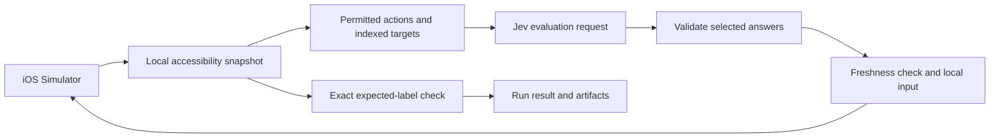

# Architecture

The Mac owns observation and input. Jev evaluates a compact accessibility snapshot and returns choices from the action space offered for that snapshot. The runner validates those choices, executes one operation, and obtains fresh evidence.

## One request, several possible decisions

The model request uses `typesafe-ai/jev` at Vercel's `/v1/evaluate` endpoint. Its state contains the goal, expected labels, compact current controls, and recent actions. Jev accepts text and JSON; it does not consume the screenshot.

One choice question selects an operation. Separate questions speculate about the target for each supported operation. Only the selected operation's target answer can affect execution. For typing, each candidate field also gets a choice among exact caller-supplied strings. After selecting a field, the runner uses only that field's value answer.

For example, an operation answer of `TAP` can select observed target `4`. Unused text-field answers have no effect. A `TYPE_TEXT` answer instead selects an observed empty field and a caller-supplied text key. The device resolves the key locally and enters the exact value; there is no text-generation model in this package.

The model adapter checks choice IDs, complete probability maps, finite values, and probability consistency. It uses one persistent HTTPS client with request, response, timeout, and call limits. Failed attempts consume the call budget. It never automatically retries a request.

## Observation and execution

The AXe adapter binds the simulator and app process. It normalizes accessible controls, filters unsupported state, and keeps coordinates in the local device layer. The model sees IDs, types, labels, values, and enabled state. Fields identified as secure are redacted before export; ordinary app labels and values may still contain private data.

Before dispatch, the adapter observes again and compares the screen fingerprint. A changed screen makes the decision stale; the runner discards it and asks again within the remaining budget. Coordinates come from the freshly observed target. The adapter consumes a dispatched observation so the same observation cannot replay input.

The runner stops when an action's outcome becomes uncertain. For typing, the adapter taps the chosen field, verifies its identity and focus, then sends the exact text through stdin. If focus cannot be established, it enters no text and returns uncertainty about the preceding tap.

Observation and input are separate OS calls. PID binding and fingerprints reduce races but cannot eliminate them. Accessibility metadata also cannot prove the absence of every custom overlay. Supported apps must expose enough state for both operation and verification.

## Completion and evidence

Expected labels are exact strings defined by the caller or scenario. The runner checks them before making a model request and after the final bounded action. A model `DONE` answer triggers a fresh local check; absent labels produce an unverified result.

`verified` therefore means the required labels were observed in the selected app. The label set must distinguish the intended destination. Use separate checks for server-side effects, visual quality, accessibility quality, and release acceptance.

NDJSON events record observations, model decisions, execution receipts, and the final result. The local HTML report presents those events for review. Screenshots and recordings are optional separate evidence and never substitute for the runtime's label check.

## Extension points

| Component | What an extension supplies |
| --- | --- |
| Scenario | Goal, expected labels, permitted actions, and run limits |
| Model adapter | Decisions over the offered operation and target maps |
| Device adapter | Current snapshots, validated input, and execution receipts |
| Host | Target selection, credentials, scheduling, artifacts, and authority |

The Python interfaces live in `jev_ios/protocols.py`. The validated scenario loader defines the accepted JSON shape. Use these source contracts when adding adapters; the architecture document does not introduce another runtime or competing schema.

A new device adapter must preserve target identity and freshness semantics. A new model adapter must return only offered operations, targets, and text keys, with finite probabilities. Keep the runner's deterministic checks even when a provider promises structured output. The current Node wrapper integrates at the host layer; native Brigade provider registration remains separate work.

## Design provenance

Daybreak is a UIKit fixture. Its design work applies [Appllama's app-design skill at the pinned revision](https://github.com/Appllama/appllama-skills/blob/dd5caaec3d5d50ad7fc0324da238119c6b7c3707/skills/appllama-app-design-skill/SKILL.md), including native controls, platform typography, a consistent accent, navigation semantics, and simulator review. The skill allows its default Expo stack to be overridden when the project already uses another stack.

The Appllama MCP was unavailable during this implementation, so use of the skill does not imply access to its design library or completion of an MCP research pass. The app's name, interface, and code are original to this fixture. No Appllama branding or library assets are bundled. [NOTICE.md](../NOTICE.md) records the source revisions and licenses.
